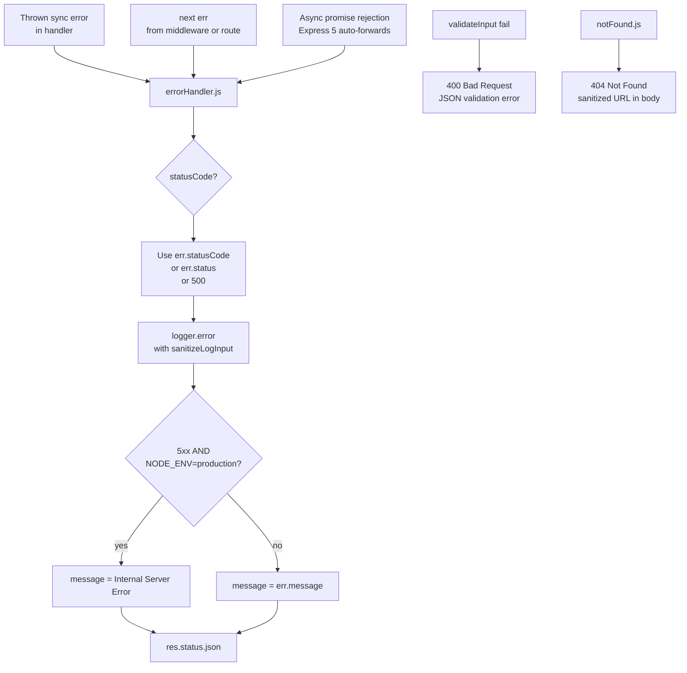

# src/middleware — Middleware Layer

## Purpose

`src/middleware/` is the defensive perimeter of the Express application. It
contains three focused modules that implement three distinct Express middleware
patterns: a factory (`validateInput`), a terminal 404 catch-all (`notFound`),
and a centralized error middleware (`errorHandler`). Together these modules
enforce per-route request validation before route handlers execute, return a
structured 404 for unmatched paths after route handlers, and emit a unified
JSON error response at the very end of the pipeline. Each module uses a
different Express middleware signature: `validateInput` is a factory returning
`(req, res, next) => ...`; `notFound` is a 3-argument terminal middleware
`(req, res, next)` that does NOT call `next()`; `errorHandler` is a 4-argument
error middleware `(err, req, res, next)` detected by Express via the function
arity check `function.length === 4`. All three modules emit the same
standardized `{ status, statusCode, message }` JSON error shape, consistent
with the rate-limit 429 handler in `src/app.js`.

Source: `src/middleware/errorHandler.js`, `src/middleware/notFound.js`,
`src/middleware/validateInput.js`, `src/app.js`.

## Key Files

| File | Role | Source |
|---|---|---|
| `src/middleware/errorHandler.js` | 4-argument Express error middleware; standardized `{ status, statusCode, message }` JSON shape; CWE-209 production masking of 5xx messages; includes `stack` in non-production | `src/middleware/errorHandler.js` |
| `src/middleware/notFound.js` | Terminal 404 catch-all; logs `warn` with `sanitizeLogInput`; reflects sanitized URL via `sanitizeUrl`; terminates the cycle (no `next()`) | `src/middleware/notFound.js` |
| `src/middleware/validateInput.js` | Zod-based validation middleware factory; re-exports `{ validateInput, z }`; fail-fast 400 on the first invalid `req.body` / `req.query` / `req.params` segment | `src/middleware/validateInput.js` |

## Architecture Fit

Each middleware occupies a specific position within the 9-step Express pipeline
defined in `src/app.js`. The order is a public contract enforced by tests, and
reordering ANY of these middleware would break the error-handling guarantees
of the application.

- **`errorHandler` is registered as the LAST `app.use()` call** in
  `src/app.js` (line 183). Express identifies error middleware by its
  4-argument signature `(err, req, res, next)` — Express checks
  `function.length === 4` to distinguish error middleware from regular
  middleware. Any middleware registered AFTER `errorHandler` would cause
  errors thrown by THAT middleware to bypass the handler. Source:
  `src/app.js` line 183; `src/middleware/errorHandler.js` JSDoc lines 14-18.
- **`notFound` is registered second-to-last** in `src/app.js` (line 171) —
  AFTER all route handlers so that only truly unmatched requests reach it,
  and BEFORE `errorHandler` so that 404s return an actual 404 rather than
  falling through to a generic 500. Source: `src/app.js` line 171;
  `src/middleware/notFound.js` JSDoc lines 11-15.
- **`validateInput` is applied at the ROUTE level, not the app level.** Each
  route handler in `src/routes/**` inserts it as per-route middleware, e.g.
  `router.get('/', validateInput(schema), handler)`. This scopes validation
  to specific endpoints rather than applying a single schema globally.
  Source: `src/routes/index.js` line 44; `src/routes/health.js` line 41;
  `src/routes/api.js` lines 33 and 71.

The diagram below traces every path by which a response leaves the application
through one of the three middleware modules.



Source: `src/middleware/errorHandler.js` lines 56-99;
`src/middleware/notFound.js` lines 42-52;
`src/middleware/validateInput.js` lines 60-82.

## Public Interface

### errorHandler

- `module.exports = errorHandler` where `errorHandler` is a 4-argument
  function. Source: `src/middleware/errorHandler.js` line 102.
- Signature: `(err, req, res, next) => void`.
- Express identifies error middleware by `function.length === 4`. The
  `next` parameter is declared but NOT called (the middleware is terminal).
  Source: `src/middleware/errorHandler.js` lines 50-51 (with the
  `eslint-disable-next-line no-unused-vars` directive acknowledging the
  unused parameter).
- Returns nothing; the side effect is `res.status(statusCode).json(response)`
  at line 99.

### notFound

- `module.exports = notFound` where `notFound` is a 3-argument function.
  Source: `src/middleware/notFound.js` line 54.
- Signature: `(req, res, next) => void`.
- The `next` parameter is declared but NOT called (the middleware is
  terminal). Source: `src/middleware/notFound.js` lines 42-52.
- Returns nothing; the side effect is `res.status(404).json(...)` at lines
  47-51.

### validateInput

- `module.exports = { validateInput, z }` — an object exposing BOTH the
  factory AND the re-exported Zod namespace. Source:
  `src/middleware/validateInput.js` line 90.
- Factory signature: `validateInput(schemas) => (req, res, next) => void`,
  where `schemas` is an object with optional `body`, `query`, and `params`
  Zod schema properties. Source: `src/middleware/validateInput.js`
  lines 38-44.
- Returns an Express middleware function that validates the configured
  request segments against the provided schemas using Zod's `safeParse`
  (non-throwing). On failure, returns HTTP 400 with
  `{ status: 'error', statusCode: 400, message: 'Validation failed: <details>' }`.
  On success, calls `next()`. Source: `src/middleware/validateInput.js`
  lines 60 (`safeParse`), 77-81 (400 response), and 86 (`next()`).
- `z` is the full Zod namespace re-exported for consumer convenience;
  route files can write `const { validateInput, z } = require('../middleware/validateInput')`
  instead of importing Zod separately.
- Fail-fast: returns immediately on the first invalid segment. Source:
  `src/middleware/validateInput.js` line 77 (`return res.status(400).json(...)`).
- Non-mutating: does NOT assign `req.body = result.data` (or equivalent).
  Handlers receive the raw, unparsed request values.

## Dependencies

### External (npm)

- `zod` — consumed ONLY by `src/middleware/validateInput.js` at line 32
  (`const { z } = require('zod')`). Declared in `/package.json`
  `dependencies`.
- `errorHandler.js` and `notFound.js` have NO external dependencies.

### Internal

- `errorHandler.js` requires `../utils/logger` (line 39) for `logger.error`
  and `../utils/sanitizer` (line 40) for `sanitizeLogInput`.
- `notFound.js` requires `../utils/logger` (line 27) for `logger.warn` and
  `../utils/sanitizer` (line 28) for both `sanitizeLogInput` AND
  `sanitizeUrl`.
- `validateInput.js` has NO internal dependencies (pure except for `zod`).

Cross-reference: see `../utils/README.md` for details on `logger` and
`sanitizer`.

## Data Flow

Three parallel flows correspond to the three middleware modules.

### 1. Validation flow (`validateInput`, per-route)

1. A route handler declares validation via
   `router.get(path, validateInput(schema), handler)`. Source:
   `src/routes/index.js` line 44; `src/routes/health.js` line 41;
   `src/routes/api.js` lines 33 and 71.
2. The factory returns a middleware function bound to the given `schemas`
   object. Source: `src/middleware/validateInput.js` lines 44-45.
3. On each request, the middleware iterates over the keys in `schemas`
   (`body`, `query`, `params`) and calls `schema.safeParse(req[key])`.
   Source: `src/middleware/validateInput.js` lines 53-60.
4. On the first `!result.success`, the middleware builds an error message
   from `result.error.errors` (Source: `src/middleware/validateInput.js`
   lines 67-74) and returns 400 with
   `{ status: 'error', statusCode: 400, message: 'Validation failed: <details>' }`.
   Source: `src/middleware/validateInput.js` lines 77-81.
5. Remaining schemas are NOT validated (fail-fast).
6. On full success, `next()` is called to hand off to the next middleware
   or the route handler. Source: `src/middleware/validateInput.js` line 86.
7. Request properties (`req.body`, `req.query`, `req.params`) are NEVER
   mutated — handlers receive the raw, unparsed request values.

### 2. 404 flow (`notFound`, after all routes)

1. When no route matches a request, Express falls through the router stack
   to `notFound` (registered at `src/app.js` line 171).
2. The middleware logs a warning with
   `` logger.warn(`404 - Not Found - ${sanitizeLogInput(req.originalUrl)}`) ``.
   Source: `src/middleware/notFound.js` line 44.
3. The middleware emits a 404 JSON response with
   `{ status: 'error', statusCode: 404, message: 'Not Found - <sanitized-url>' }`.
   Source: `src/middleware/notFound.js` lines 47-51.
4. The middleware does NOT call `next()` — the cycle terminates here.

### 3. Error flow (`errorHandler`, last-resort)

1. An error enters the handler via one of three paths:
   - Synchronous throw from any middleware or route handler (Express
     catches and forwards).
   - Explicit `next(err)` call from any middleware.
   - Rejected promise from an async middleware (Express 5 auto-forwards).
2. Status code is resolved via the fallback chain
   `err.statusCode || err.status || 500`. Source:
   `src/middleware/errorHandler.js` line 56.
3. The error is logged with `logger.error` using both
   `sanitizeLogInput(req.originalUrl)` AND `sanitizeLogInput(req.method)`.
   Source: `src/middleware/errorHandler.js` line 65.
4. The message is determined by the `isServerError && isProduction`
   short-circuit (Source: `src/middleware/errorHandler.js` lines 75-79):
   - 5xx + production → `'Internal Server Error'` (CWE-209 masking).
   - 4xx or non-production → original `err.message`.
5. The response is built as `{ status: 'error', statusCode, message }`.
   Source: `src/middleware/errorHandler.js` lines 81-85.
6. In non-production, `response.stack = err.stack` is added. Source:
   `src/middleware/errorHandler.js` lines 92-94.
7. `res.status(statusCode).json(response)` sends the response. Source:
   `src/middleware/errorHandler.js` line 99. `next()` is NOT called.

## Configuration

Only `process.env.NODE_ENV` influences the runtime behavior of this folder.
No other environment variables are read directly by these files.

- `NODE_ENV === 'production'` triggers TWO production-only behaviors in
  `errorHandler.js`:
  - 5xx message masking to `'Internal Server Error'`. Source:
    `src/middleware/errorHandler.js` lines 75-79.
  - Stack trace exclusion from the response body. Source:
    `src/middleware/errorHandler.js` lines 92-94.
- Any other value (`'development'`, `'test'`, `'staging'`, or any custom
  value) preserves the full error message AND includes the stack in the
  response.
- `validateInput.js` reads NO environment variables.
- `notFound.js` reads NO environment variables.
- `NODE_ENV` is set by `.env` (local development), the shell environment,
  or `ecosystem.config.js` `env_production.NODE_ENV: 'production'` when
  PM2 is started with `--env production`. See `../../docs/deployment.md`
  for environment-block selection details.

## Error Handling

This module IS the application's error-handling layer.

- **Error response shape:** `{ status: 'error', statusCode: <number>, message: <string> }`.
  Used by ALL three middleware AND by the rate-limit 429 handler in
  `src/app.js` (lines 141-145) — a consistent contract across 400, 404,
  405, 429, and 500 responses. Source: `src/middleware/errorHandler.js`
  lines 81-85; `src/middleware/notFound.js` lines 47-51;
  `src/middleware/validateInput.js` lines 77-81.
- **Non-production stack field:** When `process.env.NODE_ENV !== 'production'`,
  500 responses additionally include a `stack` field with the full stack
  trace. The check uses `!== 'production'` rather than `=== 'development'`,
  so test, staging, and any unrecognized environment value also receive
  the stack. Source: `src/middleware/errorHandler.js` lines 92-94.
- **Status code resolution:** `err.statusCode || err.status || 500` —
  checks the custom error convention first (many libraries set
  `statusCode`), then the Express convention (e.g., the `http-errors`
  package uses `status`), and finally falls back to 500. Source:
  `src/middleware/errorHandler.js` line 56.
- **Error logging:** Every error is logged at the `error` level with
  both `req.originalUrl` and `req.method` sanitized via
  `sanitizeLogInput`. The log line format is
  `<statusCode> - <message> - <originalUrl> - <httpMethod>`. Source:
  `src/middleware/errorHandler.js` line 65.
- **Terminal behavior:** All three middleware emit the response directly
  via `res.status(...).json(...)` and do NOT call `next()`. Nothing
  downstream can intercept these responses.

## Security Notes

The middleware layer mitigates several common web-application
vulnerabilities. CWE identifiers are provided where applicable.

- **CWE-209 (Information Exposure Through Error Message).**
  `errorHandler.js` masks 5xx messages to `'Internal Server Error'` when
  `NODE_ENV === 'production'`. The raw error message — which may include
  file paths, module names, or connection strings — is replaced with a
  generic string. Client errors (4xx) preserve their messages for
  actionable API consumer feedback. Source:
  `src/middleware/errorHandler.js` lines 75-79.
- **CWE-117 (Improper Output Neutralization for Logs / Log Injection).**
  `errorHandler.js` and `notFound.js` apply `sanitizeLogInput` to
  `req.originalUrl` (and, in `errorHandler.js`, also `req.method`) before
  logging. The helper strips ANSI escape sequences and C0 control
  characters, preventing log forging via `\r\n` injection. Source:
  `src/middleware/errorHandler.js` line 65;
  `src/middleware/notFound.js` line 44; helper at
  `src/utils/sanitizer.js`.
- **Reflected-content encoding in 404 responses.** `notFound.js` applies
  `sanitizeUrl` to `req.originalUrl` before embedding it in the 404
  message body. `sanitizeUrl` HTML-entity encodes `&`, `<`, `>`, `"`,
  and `'`. This is defense-in-depth — although `res.json()` sets
  `Content-Type: application/json`, encoding protects downstream
  consumers (log viewers, copy-paste targets) that might incorrectly
  render the payload as HTML. Source: `src/middleware/notFound.js`
  line 50; `src/utils/sanitizer.js` lines 172-177.
- **Zod strict validation.** `validateInput.js` calls Zod's `safeParse()`.
  Every route file uses `.strict()` schemas to reject unexpected keys
  (e.g., `z.object({}).strict()` rejects any query key whatsoever). This
  is the enforcement mechanism that prevents parameter-based probing
  and reflected-parameter vulnerabilities on GET endpoints. Source:
  `src/middleware/validateInput.js` line 60;
  `src/routes/index.js` line 44.
- **Zod namespace re-export.** `validateInput.js` exports `z` so route
  files have a single import surface. This is an ergonomic convenience,
  not a security mechanism. Source:
  `src/middleware/validateInput.js` line 90.
- **Non-mutating validation.** `validateInput` does NOT modify
  `req.body`, `req.query`, or `req.params`. Handlers receive the raw,
  unparsed values. This eliminates a class of bugs where middleware
  silently rewrites request data, and makes the validation step
  auditable — the request that enters the handler is identical to the
  request that entered the middleware.
- **Required 4-argument error signature.** `errorHandler.js` MUST
  declare all four parameters `(err, req, res, next)` because Express
  checks `function.length === 4` to identify error middleware. The
  `next` parameter is unused but required for arity-based detection.
  Source: `src/middleware/errorHandler.js` lines 50-51 and JSDoc
  lines 14-18.

## Examples

### Creating and using a validation middleware

```js
const { validateInput, z } = require('./middleware/validateInput');

// Reject any body key other than 'name'; reject any query key entirely.
const schema = {
  body: z.object({ name: z.string() }).strict(),
  query: z.object({}).strict()
};

router.post('/items', validateInput(schema), (req, res) => {
  res.json({ status: 'success', received: req.body });
});
```

Source: `src/middleware/validateInput.js` JSDoc `@example` block
(lines 21-27); usage pattern from `src/routes/index.js` line 44.

### Observing each middleware's output

```bash
# 400 from validateInput — query rejection on a route that allows no query
curl -i 'http://localhost:3000/?unexpected=1'

# 404 from notFound — path that matches no route
curl -i http://localhost:3000/does/not/exist

# 405 from the route-level router.all guard — wrong method on the root path
# (errorHandler returns 500 only for truly thrown errors; in this service the
#  curl below intentionally exercises the 405 guard from src/routes/index.js)
curl -i -X POST http://localhost:3000/
```

Source: `src/routes/index.js`; `src/middleware/notFound.js`;
`src/middleware/errorHandler.js`.

### Standardized error response shape

```json
{
  "status": "error",
  "statusCode": 404,
  "message": "Not Found - /does/not/exist"
}
```

Source: `src/middleware/notFound.js` lines 47-51.

## Limitations

Be explicit about what this folder does NOT provide.

- **No per-route error handlers.** All errors funnel to the single
  `errorHandler.js` registered at the app level. Route-level `try/catch`
  blocks are not used.
- **`validateInput` does NOT mutate `req.body`, `req.query`, or
  `req.params`.** No Zod transform coercion is applied to the request.
  Handlers receive the raw, unparsed values — transforms declared in
  schemas (e.g., `z.coerce.number()`) would parse on the validation side
  but would NOT be reflected back into `req`.
- **`validateInput` fails fast.** On the first invalid segment, it returns
  400 without validating the remaining segments. Error details describe
  only the first failure. Source:
  `src/middleware/validateInput.js` line 77 (the early `return`).
- **No support for async Zod refinements.** The factory uses `safeParse`,
  not `safeParseAsync`. Schemas containing async refinements
  (e.g., `.refine(async () => ...)`) would NOT validate correctly.
- **No rate limiting, authentication, or authorization logic in this
  folder.** Rate limiting is configured in `src/app.js` (step 6 of the
  middleware pipeline). Authentication and authorization are not
  implemented in this service.
- **`errorHandler.js` does NOT modify `Content-Type`.** It relies on the
  Express default `application/json` produced by `res.json()`.
- **`errorHandler.js` does NOT handle `HEAD` requests specially.** The
  `res.json()` call sends a body; for `HEAD` requests, Express strips the
  body automatically before transmission.
- **`notFound.js` does NOT set a custom `Content-Type` for the 404
  message.** The sanitized URL is embedded inside a JSON string —
  downstream tools must treat the `message` field as plain text (which
  happens to be HTML-entity encoded).
- **`errorHandler.js` logs at `error` level unconditionally.** There is
  no filtering by status code — a 400 forwarded via `next(err)` with
  `statusCode: 400` would be logged at `error`, potentially creating
  noise in `logs/error.log`. In practice, 400s from `validateInput` do
  NOT reach `errorHandler` because `validateInput` sends the 400
  response directly.
- **Stack inclusion uses `!== 'production'`**, not `=== 'development'`.
  Test, staging, and any custom environment also receive the `stack`
  field in 500 responses. Operators concerned about stack exposure in
  pre-production environments should set `NODE_ENV=production` there.

## See Also

- [Module parent: src](../README.md)
- [Configuration module](../config/README.md)
- [Routes module](../routes/README.md)
- [Utilities module](../utils/README.md)
- [Architecture guide](../../docs/architecture.md)
- [API reference](../../docs/api.md)
- [Security guide](../../docs/security.md)
- [Observability guide](../../docs/observability.md)
- [Deployment guide](../../docs/deployment.md)
- [Testing guide](../../docs/testing.md)
- [Back to project README](../../README.md)
