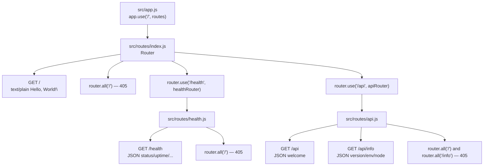

# src/routes — Routing Layer

## Purpose

This folder contains the application's first-layer Express routing surface. It is composed of three CommonJS router modules — `index.js`, `health.js`, and `api.js` — that together define the four HTTP endpoints exposed by the service: `GET /`, `GET /health`, `GET /api`, and `GET /api/info`. Every `router.get(...)` registration in this folder is paired with a corresponding `router.all(...)` 405 method guard that returns the `Allow: GET, HEAD` header per RFC 9110 §15.5.6, and every `router.get(...)` is preceded by `validateInput({ body: z.object({}).strict().optional(), query: z.object({}).strict() })` from `../middleware/validateInput`, which rejects unexpected request bodies and query keys with a 400 response.

The single integration point with the Express application is `src/app.js` line 161 (`app.use('/', routes)`), which mounts `src/routes/index.js` — the aggregator that mounts the other two sub-routers at `/health` and `/api`.

Source: `src/routes/index.js`, `src/app.js` line 161.

## Key Files

| Path | Role | Source |
|---|---|---|
| `src/routes/index.js` | Root router aggregator; mounts `/health` and `/api`; defines `GET /` (plain text `Hello, World!\n`) and its 405 guard | `src/routes/index.js` |
| `src/routes/health.js` | Health-check router; `GET /` returns `{ status, uptime, timestamp, memory, nodeVersion }`; unauthenticated by design | `src/routes/health.js` |
| `src/routes/api.js` | API namespace router; `GET /api` welcome; `GET /api/info` metadata (version, environment, nodeVersion) | `src/routes/api.js` |

## Architecture Fit

The routing layer uses a **router-of-routers aggregation model**:

- `src/app.js` mounts exactly ONE router at `/` (Source: `src/app.js` line 161).
- That single router is `src/routes/index.js` (Source: the `module.exports = router` at `src/routes/index.js` line 76).
- `src/routes/index.js` in turn mounts `./health` at `/health` (line 67) and `./api` at `/api` (line 74).
- Each sub-router exports its own `express.Router()` instance with its own handler(s).

The aggregation model isolates each namespace in its own file — `/health` operational data, `/api` REST payloads, and the root route — while keeping the mount topology visible in a single file (`src/routes/index.js`). This is the convention used by `src/app.js` to stay at one level of indirection from path to handler.



The diagram mirrors the mount order in `src/routes/index.js` (root handlers first, then `/health` at line 67, then `/api` at line 74).

## Public Interface

Each of the three files exports a single Express `Router` instance via CommonJS `module.exports = router`:

- `src/routes/index.js` line 76: `module.exports = router;`
- `src/routes/health.js` line 63: `module.exports = router;`
- `src/routes/api.js` line 103: `module.exports = router;`

The root router is consumed by `src/app.js` exactly once:

```js
// src/app.js (excerpt)
const routes = require('./routes');
app.use('/', routes);
```

Source: `src/app.js` line 161.

Because `require('./routes')` resolves to `./routes/index.js` (Node.js default `index.js` resolution), only the root aggregator is imported directly by `src/app.js`. The `health` and `api` sub-routers are consumed transitively through `src/routes/index.js` lines 20–21 and mounted at lines 67 and 74.

## Dependencies

**External (npm):**

- `express` — Router factory (`express.Router()`) used by all three files (Source: `src/routes/index.js` line 19; `src/routes/health.js` line 16; `src/routes/api.js` line 16).

**Internal (relative):**

- `../middleware/validateInput` — Provides `{ validateInput, z }`; consumed by all three files (Source: `src/routes/index.js` line 22; `src/routes/health.js` line 17; `src/routes/api.js` line 18).
- `../config` — Consumed ONLY by `src/routes/api.js` line 17 for `config.env` in the `/api/info` payload.
- `../../package.json` — Consumed ONLY by `src/routes/api.js` line 83 (dynamic `require` at request time) for `data.version`.
- `./health` — Consumed by `src/routes/index.js` line 20 for mounting at `/health`.
- `./api` — Consumed by `src/routes/index.js` line 21 for mounting at `/api`.

## Data Flow

A request flows through the routing layer as follows:

1. A request arrives at `src/app.js` and traverses the 9-step middleware pipeline (Helmet → CORS → compression → body parsers → Morgan → rate limiter). See `../README.md` (the `src/` module README) and `../../docs/architecture.md` for the full pipeline.
2. At step 7 of the pipeline, `app.use('/', routes)` delegates to `src/routes/index.js` (Source: `src/app.js` line 161).
3. `src/routes/index.js` dispatches based on URL:
   - `GET /` → handler at line 44, after `validateInput` passes.
   - Any other method on `/` → `router.all('/')` at line 54 → 405 with `Allow: GET, HEAD`.
   - Path starts with `/health` → forwarded to `src/routes/health.js`.
   - Path starts with `/api` → forwarded to `src/routes/api.js`.
   - No match → continues to `notFound` middleware (Source: `src/app.js` line 171).
4. Within `src/routes/health.js` and `src/routes/api.js`, the same pattern repeats: `router.get(path)` handles GETs, and `router.all(path)` returns 405 for all other methods.
5. Every `router.get` handler applies `validateInput({ body: z.object({}).strict().optional(), query: z.object({}).strict() })` BEFORE the handler body runs.
6. If `validateInput` fails, it short-circuits with a 400 JSON response (Source: `src/middleware/validateInput.js` lines 77–81); the route handler does NOT run.
7. On success, the route handler sends the response via `res.json(...)` or `res.type('text/plain').send(...)`.

Source: `src/app.js` line 161, `src/routes/index.js`, `src/routes/health.js`, `src/routes/api.js`, `src/middleware/validateInput.js`.

## Configuration

This folder is largely free of environment-driven configuration; the four handlers read the following at request time:

- **`GET /`** — No runtime reads; the response body `'Hello, World!\n'` is a static literal (Source: `src/routes/index.js` line 46).
- **`GET /health`** — Reads `process.uptime()`, `process.memoryUsage()`, `process.version`, and the current wall-clock time via `new Date().toISOString()` (Source: `src/routes/health.js` lines 44–47). No environment variables are read directly.
- **`GET /api`** — No runtime reads; the response body is static (Source: `src/routes/api.js` lines 39–42).
- **`GET /api/info`** — Reads `require('../../package.json').version` (Source: `src/routes/api.js` line 83), `config.env` (Source: line 84), and `process.version` (Source: line 85). `config.env` is derived from `process.env.NODE_ENV || 'development'` via the frozen config at `src/config/index.js`.

All validation schemas are constructed once per module-load via `z.object({}).strict().optional()` / `z.object({}).strict()` — no per-request schema compilation. Source: `src/routes/index.js` line 44; `src/routes/health.js` line 41; `src/routes/api.js` lines 38, 79.

## Error Handling

The routing layer has three error paths, all converging on the centralized error handler:

- **Centralized handler**: Any synchronous throw, explicit `next(err)` call, or rejected Promise in any route handler flows to the centralized error handler at `src/middleware/errorHandler.js`. Express 5 auto-forwards async promise rejections to error middleware. The error handler is registered last in `src/app.js` line 183 (`app.use(errorHandler)`).
- **400 from `validateInput`**: Validation failures short-circuit BEFORE the route handler runs, returning the standardized shape `{ status: 'error', statusCode: 400, message: 'Validation failed: ...' }` (Source: `src/middleware/validateInput.js` lines 77–81).
- **405 from method guards**: The `router.all(...)` 405 guards return a synchronous response with `{ status: 'error', statusCode: 405, message: 'Method Not Allowed' }` and the `Allow: GET, HEAD` header — they never call `next()` (Source: `src/routes/index.js` lines 54–60; `src/routes/health.js` lines 55–61; `src/routes/api.js` lines 52–58, 95–101).

Route handlers in this folder do NOT currently throw or call `next(err)` — all response paths are straight-line synchronous `res.json(...)` or `res.type('text/plain').send(...)` calls.

[Middleware module →](../middleware/README.md)

## Security Notes

- **Method rejection with 405**: Every `router.get('/...')` is paired with a `router.all('/...')` that returns 405 with the `Allow: GET, HEAD` header (Source: `src/routes/index.js` lines 54–60; `src/routes/health.js` lines 55–61; `src/routes/api.js` lines 52–58, 95–101). Rationale: Express `router.get()` matches only GET/HEAD; other methods bypass the route chain (including `validateInput`) and would otherwise fall through to `notFound`, returning a misleading 404. RFC 9110 §15.5.6 requires the `Allow` header on 405 responses.
- **Strict Zod input validation**: Every `router.get` applies `validateInput({ body: z.object({}).strict().optional(), query: z.object({}).strict() })`. Unknown keys in either `body` or `query` are rejected with a 400. Rationale: defense-in-depth against parameter probing, reflected-parameter vulnerabilities, and accidental request shape drift. This is unusual for a simple hello-world service but consistent with the project's security posture. (Source: `src/routes/index.js` line 44; `src/routes/health.js` line 41; `src/routes/api.js` lines 38, 79.)
- **Byte-identical `GET /` contract**: `src/routes/index.js` line 46 returns `res.type('text/plain').send('Hello, World!\n');` — the exact body including trailing newline is test-enforced by `tests/routes/index.test.js`. Any change to the body or content-type breaks the contract.
- **`/health` is unauthenticated by design**: The JSDoc header at `src/routes/health.js` lines 8–9 explicitly states that this endpoint requires no authentication and must remain freely accessible for automated monitoring systems. This is intended for PM2 probes, Kubernetes `livenessProbe`/`readinessProbe`, AWS ALB health checks, etc. Rate limiting still applies — `/health` is NOT exempt.
- **No reflected user input**: None of the handlers in this folder reflect `req.body`, `req.query`, `req.params`, or any header into the response. The 404 reflection is handled by `src/middleware/notFound.js`, not by any route in this folder.

[Security guide →](../../docs/security.md)

## Examples

**Observable behavior (`bash`):**

```bash
# Root route — plain text, exact body including trailing newline
curl -i http://localhost:3000/
# HTTP/1.1 200 OK
# Content-Type: text/plain; charset=utf-8
# Content-Length: 14
#
# Hello, World!

# Health check — JSON payload for PM2 / load balancer probes
curl -s http://localhost:3000/health | jq .
# {
#   "status": "ok",
#   "uptime": 12.345,
#   "timestamp": "2024-05-20T14:22:11.042Z",
#   "memory": { "rss": 52428800, "heapTotal": 33554432, "heapUsed": 18874368 },
#   "nodeVersion": "v20.20.1"
# }

# API welcome
curl -s http://localhost:3000/api | jq .
# { "status": "success", "message": "Welcome to the API" }

# API info — reads package.json version and config.env
curl -s http://localhost:3000/api/info | jq .
# {
#   "status": "success",
#   "data": {
#     "version": "1.0.0",
#     "environment": "development",
#     "nodeVersion": "v20.20.1"
#   }
# }

# 405 Method Not Allowed — non-GET on any route
curl -i -X POST http://localhost:3000/
# HTTP/1.1 405 Method Not Allowed
# Allow: GET, HEAD
# Content-Type: application/json
#
# {"status":"error","statusCode":405,"message":"Method Not Allowed"}

# 400 Validation Failed — unexpected query parameter
curl -i "http://localhost:3000/?foo=bar"
# HTTP/1.1 400 Bad Request
# Content-Type: application/json
#
# { "status": "error", "statusCode": 400,
#   "message": "Validation failed: query: Unrecognized key(s) in object: 'foo'" }
```

Source: `src/routes/index.js`, `src/routes/health.js`, `src/routes/api.js`, `src/middleware/validateInput.js`.

**Programmatic mounting (`js`):**

```js
// This is how src/app.js consumes the router aggregator.
const express = require('express');
const routes = require('./routes'); // resolves to src/routes/index.js
const app = express();
// ... other middleware ...
app.use('/', routes);
```

Source: `src/app.js` line 161.

**Testing with Supertest (`js`):**

```js
// The app factory pattern enables in-memory testing without app.listen()
const request = require('supertest');
const app = require('../src/app');

test('GET / returns byte-identical Hello, World!\\n', async () => {
  const res = await request(app).get('/');
  expect(res.status).toBe(200);
  expect(res.headers['content-type']).toMatch(/text\/plain/);
  expect(res.text).toBe('Hello, World!\n');
});
```

Source: `tests/routes/index.test.js`.

## Limitations

The routing layer intentionally omits the following — every bullet below reflects the current code as-is and must NOT be interpreted as a planned feature:

- **No dynamic path parameters.** All route paths (`/`, `/health`, `/api`, `/api/info`) are static string literals — there are no `:id` or `/*` patterns.
- **No query parameters accepted.** The strict empty-query Zod schema (`z.object({}).strict()`) rejects ALL query keys on every GET route.
- **No request bodies accepted on GETs.** The `body: z.object({}).strict().optional()` schema allows an absent/empty body but rejects ANY keys.
- **No pagination, sorting, or filtering.** No list endpoints exist; every successful response is either static or a single fixed-shape JSON object.
- **No API versioning in the URL path.** There is no `/api/v1` or `/api/v2` prefix; `/api` is unversioned. Version is reported via `GET /api/info` as `data.version`, which reads `package.json`.
- **`/api/info` reads `package.json` at request time.** The `require('../../package.json')` call on `src/routes/api.js` line 83 is inside the handler. Node.js caches `require` results, so the file is read from disk only on the first request — subsequent requests return the cached value. To force a re-read, restart the process.
- **`/health` reports per-worker state in PM2 cluster mode.** Each worker reports ONLY its own `process.uptime()` and `process.memoryUsage()`. A single `GET /health` hits ONE worker and reflects its state, not the cluster's aggregate.
- **Rate limiting is NOT route-specific.** The 100 requests / 15 minutes default from `express-rate-limit` applies uniformly; `/health` is NOT exempt, so high-frequency probes from many sources can consume the window.
- **No authentication, authorization, or session management.** There is no auth layer in this folder or in the broader application.
- **No WebSocket, SSE, or streaming endpoints.** All responses are short, synchronous, and fully buffered.

Source: `src/routes/index.js`, `src/routes/health.js`, `src/routes/api.js`, `src/app.js` (rate limiter, step 6 of the middleware pipeline).

## See Also

- [Source app module README](../README.md)
- [Middleware module README](../middleware/README.md)
- [Project root README](../../README.md)
- [Architecture guide](../../docs/architecture.md)
- [API reference](../../docs/api.md)
- [Security guide](../../docs/security.md)
- [Observability guide](../../docs/observability.md)
