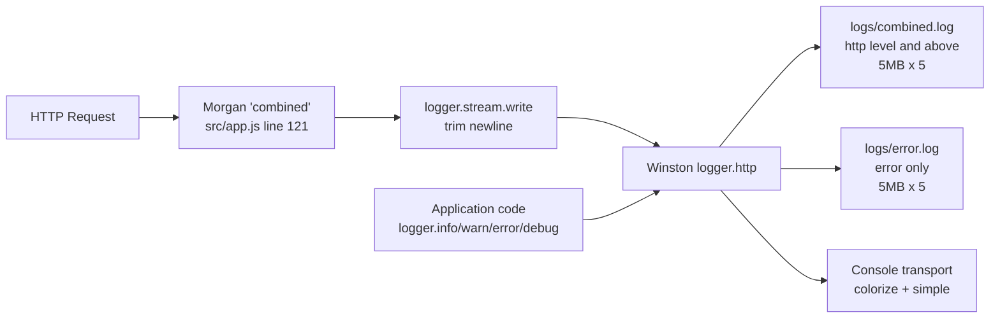

# src/utils — Utility Layer

## Purpose

`src/utils/` is the reusable infrastructure layer of the service. It packages
two concerns that are needed at many call sites across the codebase: a
**centralized structured logger** and **defensive text-handling primitives**
for untrusted input. The logger module (`logger.js`) is required by
`src/app.js`, `src/middleware/errorHandler.js`, `src/middleware/notFound.js`,
and `server.js`. The sanitizer module (`sanitizer.js`) is required by
`src/middleware/errorHandler.js` and `src/middleware/notFound.js`. Together
these two modules form the observability and defensive-text foundation of the
service: every log line passes through Winston, and every attacker-influenced
string that is logged or reflected into a JSON response body passes through a
sanitizer.

Source: `src/utils/logger.js`, `src/utils/sanitizer.js`, `src/app.js`,
`src/middleware/errorHandler.js`, `src/middleware/notFound.js`, `server.js`.

## Key Files

| File | Role | Source |
|---|---|---|
| `src/utils/logger.js` | Winston logger instance with JSON file transports (`logs/combined.log` capturing `http` level and above, `logs/error.log` capturing `error` only, both with 5 MB × 5 rotation), a colorized console transport, `defaultMeta: { service: 'hello-world' }`, log level driven by `config.logLevel`, and a Morgan-compatible `logger.stream.write` adapter | `src/utils/logger.js` |
| `src/utils/sanitizer.js` | Pure, dependency-free helpers: `sanitizeLogInput` (strips ANSI escapes and C0 control characters; caps at 1000 chars with `...[truncated]` indicator) and `sanitizeUrl` (same pipeline plus HTML-entity encoding of `&`, `<`, `>`, `"`, `'`; caps at 2048 chars) | `src/utils/sanitizer.js` |

## Architecture Fit

Both modules are consumed from multiple layers of the application. The
diagram in this section shows the data flow into the logger; the bullet
lists below enumerate the exact call sites for each module.

`logger.js` is required by:

- `src/app.js` — used as Morgan's writable-stream sink:
  `app.use(morgan('combined', { stream: logger.stream }))`.
  Source: `src/app.js` lines 121-123.
- `src/middleware/errorHandler.js` — used for `logger.error(...)` at the
  error log site. Source: `src/middleware/errorHandler.js` line 39.
- `src/middleware/notFound.js` — used for `logger.warn(...)` at the 404
  log site. Source: `src/middleware/notFound.js` line 27.
- `server.js` — used for `logger.info(...)` at startup and shutdown and
  `logger.error(...)` from the `unhandledRejection` and `uncaughtException`
  safety nets. Source: `server.js`.

`sanitizer.js` is required by:

- `src/middleware/errorHandler.js` — applies `sanitizeLogInput` to
  `req.originalUrl` and `req.method` before they are interpolated into the
  `logger.error(...)` message. Source: `src/middleware/errorHandler.js`
  line 40.
- `src/middleware/notFound.js` — applies `sanitizeLogInput` to the log
  line AND `sanitizeUrl` to the JSON response body field. Source:
  `src/middleware/notFound.js` line 28.

The following diagram shows how HTTP requests and direct application calls
both converge on the Winston logger and are routed across its three
transports.



Source: `src/utils/logger.js`, `src/app.js` lines 121-123.

## Public Interface

This section lists the runtime surface of each module. All signatures match
the current source exactly.

`src/utils/logger.js` exports a single value — a Winston `Logger` instance —
via `module.exports = logger`. Source: `src/utils/logger.js` line 128.

- The instance carries an attached `stream` property — an object of the
  shape `{ write(message) { /* ... */ } }` (plain CommonJS object literal,
  not a Node.js writable stream). The `write` method calls
  `logger.http(message.trim())`, which is the bridge that makes the logger
  Morgan-compatible. Source: `src/utils/logger.js` lines 111-115 (stream
  object with `write` method on line 113) and line 122
  (`logger.stream = stream;`).
- The standard Winston level methods are inherited from the instance:
  - `logger.error(message, [meta])` — written to `logs/error.log` AND
    `logs/combined.log` AND the console transport.
  - `logger.warn(message, [meta])` — written to `logs/combined.log` and
    the console transport (the error file transport filters it out).
  - `logger.info(message, [meta])` — same routing as `logger.warn`.
  - `logger.http(message, [meta])` — same routing as `logger.warn`; this
    is the method invoked internally by `logger.stream.write`.
  - `logger.debug(message, [meta])` — emitted only when `config.logLevel`
    is `debug` or finer, and then reaches the console transport only (the
    combined-log transport's `level: 'http'` filter excludes `debug`).
- File transports use the base format pipeline
  (`timestamp` → `errors` → `json`); the console transport overrides the
  base with `colorize` + `simple` for terminal readability.
- Source: `src/utils/logger.js` lines 35-93 for the full Winston
  configuration and transport list.

`src/utils/sanitizer.js` exports two pure functions via
`module.exports = { sanitizeLogInput, sanitizeUrl }`. Source:
`src/utils/sanitizer.js` line 192.

- `sanitizeLogInput(input)` — accepts any value. Returns a string suitable
  for inclusion in log messages: strips ANSI escapes and C0 control
  characters, then caps the output at `MAX_LOG_LENGTH` (1000) characters
  with the `...[truncated]` indicator. Returns `''` for `null` and
  `undefined`. Non-string values are coerced via `String(input)`. Source:
  `src/utils/sanitizer.js` lines 97-125.
- `sanitizeUrl(input)` — accepts any value. Returns a string suitable for
  inclusion in JSON response bodies that reflect attacker-influenced URLs:
  same strip pipeline as `sanitizeLogInput`, plus HTML-entity encoding for
  `&`, `<`, `>`, `"`, `'`, then caps the output at `MAX_URL_LENGTH` (2048)
  characters. Source: `src/utils/sanitizer.js` lines 149-186.

## Dependencies

External (npm) dependencies:

- `winston` (declared in `/package.json` `dependencies`) — consumed only by
  `src/utils/logger.js` at line 23. The pinned semver range is captured in
  `/package.json` and `/package-lock.json`; this README intentionally does
  not restate the version (it is owned by the manifest). Source:
  `src/utils/logger.js` line 23, `/package.json`.
- `src/utils/sanitizer.js` has **NO external dependencies**.

Internal dependencies:

- `src/utils/logger.js` requires `../config` to read `config.logLevel`.
  Source: `src/utils/logger.js` line 24.
- `src/utils/sanitizer.js` requires **NO internal modules**.

`src/utils/sanitizer.js` has ZERO `require(...)` statements in the file.
This is a deliberate design choice that keeps the sanitizer safely callable
from any context — including, hypothetically, from inside the logger
ecosystem itself — without risk of circular dependencies between
infrastructure modules. Source: `src/utils/sanitizer.js` (inspect the file
header: only `'use strict'` and a JSDoc block precede the constants and
function declarations; no `require` calls appear).

## Data Flow

This section traces three parallel data flows: HTTP access logs that travel
the Morgan bridge, direct application logs that bypass Morgan, and the
sanitization pipeline that protects log lines and reflected response
content.

Morgan bridge flow (HTTP access logs):

1. An incoming HTTP request reaches the Morgan middleware registered in
   `src/app.js` at line 121.
2. Morgan formats the access log line using the `'combined'` format
   (Apache-style: remote address, date, method, URL, HTTP version, status
   code, content length, referrer, and user-agent).
3. Morgan writes the formatted line (with a trailing `\n`) to
   `logger.stream.write(message)`. Source: `src/utils/logger.js`
   lines 111-115 (stream object).
4. The adapter calls `.trim()` to remove Morgan's trailing newline, then
   invokes `logger.http(trimmed)`. Source: `src/utils/logger.js`
   lines 112-114 (`write` method body, with `logger.http(message.trim())`
   on line 113).
5. Winston routes the `http`-level entry through the base format pipeline
   (`timestamp` → `errors` → `json`) and dispatches it to:
   - `logs/combined.log` — accepted because the transport's
     `level: 'http'` matches. Source: `src/utils/logger.js` line 66
     (`level: 'http'` inside the combined file transport).
   - The console transport — accepted because the Console transport has
     no explicit `level` and therefore accepts everything the root logger
     emits. The colorize + simple format overrides the JSON base format.
     Source: `src/utils/logger.js` lines 86-91.
   - NOT `logs/error.log` — rejected because the transport's
     `level: 'error'` requires `error` severity (level 0). Source:
     `src/utils/logger.js` line 77.

Direct application log flow:

1. Application code (in `server.js`, the middleware, or any future
   consumer) calls one of `logger.error`, `logger.warn`, `logger.info`,
   `logger.http`, or `logger.debug` directly.
2. Winston dispatches the entry to its transports, filtered by each
   transport's `level`:
   - `error` reaches all three transports (combined file, error file,
     console).
   - `warn`, `info`, and `http` reach the combined file and the console
     transport (the error file transport filters them out).
   - `debug` is emitted by the root logger only when `config.logLevel`
     is `debug` or finer. Even when emitted, it does NOT reach
     `logs/combined.log` because that transport's `level: 'http'` caps
     verbosity at the `http` severity. It DOES reach the console
     transport. Source: `src/utils/logger.js` line 40 (root logger
     `level`) and line 66 (combined-file transport `level: 'http'`).
3. All file-transport output is JSON-serialized and decorated with the
   `timestamp` field and the `defaultMeta` `{ service: 'hello-world' }`
   property. Source: `src/utils/logger.js` lines 46-50 (format pipeline)
   and line 54 (`defaultMeta`).

Sanitization flow (`errorHandler.js` and `notFound.js`):

1. A request reaches `errorHandler` (after an upstream throw or
   `next(err)`) or `notFound` (when no route matched). The middleware has
   access to `req.originalUrl` and `req.method`, both of which are
   attacker-influenced.
2. Before passing either field to `logger.warn(...)` or
   `logger.error(...)`, the middleware invokes
   `sanitizeLogInput(field)`. Source: `src/middleware/notFound.js`
   line 44; `src/middleware/errorHandler.js` line 65.
3. Before interpolating `req.originalUrl` into a JSON response body, the
   middleware invokes `sanitizeUrl(req.originalUrl)`. This applies only
   to `notFound.js`; `errorHandler.js` does not reflect the URL into its
   response body. Source: `src/middleware/notFound.js` line 50.
4. Both sanitizer functions return strings that are free of ANSI escapes,
   free of C0 control characters, and — for `sanitizeUrl` — free of
   unencoded HTML-unsafe characters. Source: `src/utils/sanitizer.js`
   lines 97-186.

## Configuration

This section enumerates every configurable and hardcoded value in the
utility layer. Distinguishing the two prevents operators from expecting
runtime behavior that is not actually wired through `process.env`.

Environment-driven configuration:

- `logger.js` reads `config.logLevel` once at module load and uses it as
  the root Winston logger level. Source: `src/utils/logger.js` line 40;
  `src/config/index.js` line 30.
  - Default: `'debug'` (from `src/config/index.js` line 30, fallback used
    when `LOG_LEVEL` is unset).
  - Override: set `LOG_LEVEL` in `.env` (or in the relevant
    `ecosystem.config.js` env block) to any of the npm Winston levels:
    `error`, `warn`, `info`, `http`, `verbose`, `debug`, `silly`.
    Source: `.env.example` lines 29-30.
  - Constraint: the `config` object is `Object.freeze`-d, so the level
    cannot be changed at runtime — a process restart is required.
    Source: `src/config/index.js` line 42.

Hardcoded file paths (not configurable):

- `'logs/combined.log'`. Source: `src/utils/logger.js` line 65.
- `'logs/error.log'`. Source: `src/utils/logger.js` line 76.
- Paths are relative to the Node CWD (process working directory). Both
  `node server.js` and `pm2 start ecosystem.config.js` run from the
  repository root, so these resolve to `<repo>/logs/combined.log` and
  `<repo>/logs/error.log`.

Hardcoded rotation limits (not configurable):

- `maxsize: 5242880` (5 MB per file). Source: `src/utils/logger.js`
  lines 67 (combined transport) and 78 (error transport).
- `maxFiles: 5` (retains up to 5 rotated files per transport). Source:
  `src/utils/logger.js` lines 68 (combined transport) and 79 (error
  transport).

Hardcoded logger metadata (not configurable):

- `defaultMeta: { service: 'hello-world' }`. Source:
  `src/utils/logger.js` line 54.

Hardcoded sanitizer constants (not configurable):

- `MAX_LOG_LENGTH = 1000`. Source: `src/utils/sanitizer.js` line 45.
- `MAX_URL_LENGTH = 2048`. Source: `src/utils/sanitizer.js` line 53.
- `TRUNCATION_INDICATOR = '...[truncated]'`. Source:
  `src/utils/sanitizer.js` line 59.

Hardcoded sanitizer regex patterns (not configurable):

- `ANSI_ESCAPE_PATTERN = /\x1b\[[\d;]*[a-zA-Z]/g`. Source:
  `src/utils/sanitizer.js` line 68.
- `CONTROL_CHAR_PATTERN = /[\x00-\x1f\x7f]/g`. Source:
  `src/utils/sanitizer.js` line 74.

To tune the log level, set `LOG_LEVEL` in `.env` and restart the process.
All other values listed above require a source-code change.

## Error Handling

This section describes how the utility layer behaves on failure. The
distinction between "logger errors" and "sanitizer errors" is important
because they have different recovery semantics.

Sanitizer error posture:

- Neither `sanitizeLogInput` nor `sanitizeUrl` throws an exception. Both
  functions normalize `null` and `undefined` to `''` (empty string) at
  the top of the body, and they coerce non-string inputs to strings via
  `String(input)`. Source: `src/utils/sanitizer.js` lines 98-101 and
  150-153.
- The sanitizers perform no I/O and have no side effects, so there is no
  failure mode beyond the pure-function contract. Inputs go in, sanitized
  strings come out.

Logger error posture:

- `src/utils/logger.js` does NOT register any custom transport-error
  handlers, does NOT attach any `'error'` event listener on the logger
  instance, and does NOT wrap `logger.info(...)` / `logger.warn(...)` /
  `logger.error(...)` calls in `try/catch`. Source: inspection of
  `src/utils/logger.js` (no `.on('error', ...)` and no `try`/`catch`
  blocks appear in the file).
- This means transport-error behavior is delegated entirely to Winston.
  Refer to the upstream Winston documentation for that behavior; this
  README intentionally does NOT make operational guarantees about
  Winston's internal error handling because that behavior is owned by
  the upstream library, not by this module.
- Operators should monitor disk availability under `logs/` because both
  file transports write there (`logs/combined.log` and `logs/error.log`).
  See Source: `src/utils/logger.js` line 65 and line 76 for the
  hardcoded paths.
- This module emits no `throw` statements of its own. Source: inspection
  of `src/utils/logger.js` (no `throw` keyword appears in the file).

No runtime exceptions originate from this folder under normal operation.
Source: inspection of `src/utils/logger.js` and `src/utils/sanitizer.js`
(no `throw` statements appear in either file).

## Security Notes

This section captures the security-relevant behavior of the utility
layer. Cross-cutting policy and the application-wide threat model are
canonically documented in `docs/security.md`; this section only describes
what is enforced inside `src/utils/`.

- **CWE-117 (Improper Output Neutralization for Logs).** `sanitizeLogInput`
  strips ANSI escape sequences (for example, `\x1b[31m`) and every C0
  control character (`\x00`–`\x1f`, plus `\x7f` DEL) from its input. This
  prevents an attacker from using `\r\n` sequences inside `req.originalUrl`
  to inject fake log lines (log forging) and prevents terminal-rendering
  attacks via ANSI color codes that obscure or rewrite log output when
  viewed in a terminal-based log viewer. Source: `src/utils/sanitizer.js`
  lines 65-74, 97-125.
- **Order of operations is security-critical.** The ANSI multi-character
  pattern is applied BEFORE the per-character control-character pattern.
  ANSI sequences like `\x1b[31m` are multi-character sequences; removing
  the leading `\x1b` (a C0 control character) first would leave the
  trailing `[31m` literal in the output. Source:
  `src/utils/sanitizer.js` lines 106-108 (comment block describing the
  ordering rationale).
- **Length caps mitigate log-volume DoS and oversize reflection.**
  `sanitizeLogInput` caps output at 1000 characters; `sanitizeUrl` caps
  at 2048 characters (matching the conventional browser/server URL
  length limit). Source: `src/utils/sanitizer.js` lines 45, 53.
- **Truncation indicator preserves audit signal.** When a value is
  shortened, the suffix `...[truncated]` is appended. This protects
  against silent data loss during incident analysis: a truncated value
  is visibly truncated. Source: `src/utils/sanitizer.js` lines 59, 121,
  182.
- **HTML-entity encoding in `sanitizeUrl` is defense-in-depth.** The
  encoder runs `&` → `&amp;` FIRST, then `<` → `&lt;`, `>` → `&gt;`,
  `"` → `&quot;`, `'` → `&#x27;`. Running `&` first is essential — if
  any other entity were substituted first, the encoder would later
  double-encode the `&` characters introduced by those substitutions
  (for example, `<` → `&lt;` followed by `&` → `&amp;` would produce
  `&amp;lt;`). Source: `src/utils/sanitizer.js` lines 172-177. The
  JSON responses are served with `Content-Type: application/json`, so
  HTML interpretation is not the primary risk path; HTML-entity
  encoding is layered on top as an extra safety net.
- **Structured JSON log format limits some injection vectors.** The
  Winston base format pipeline is
  `combine(timestamp(), errors({ stack: true }), json())`. Each log
  entry is serialized as a JSON object rather than as a concatenated
  text line, which inherently resists some log-injection vectors that
  rely on newline insertion. Explicit sanitization is still applied at
  call sites as defense-in-depth per OWASP guidance. Source:
  `src/utils/logger.js` lines 46-50; `src/utils/sanitizer.js`
  lines 29-33.
- **Dedicated error file enables focused alerting.** `logs/error.log`
  captures only entries at the `error` level, so alerting and incident
  dashboards can subscribe to this file without seeing noise from
  routine `info`/`warn` lines. Source: `src/utils/logger.js`
  lines 75-80.

## Examples

The examples below are drawn from real usage in the codebase. Paths in the
`require(...)` calls assume the example file lives in `src/` (one level
above `src/utils/`); adjust the path if the caller lives at a different
depth.

Example 1 — using the logger from application code:

```js
const logger = require('./utils/logger');

// Level-routed emission
logger.info('Server booted');
logger.warn('Cache miss', { key: 'user:42' });
logger.error('DB unreachable', new Error('ECONNREFUSED'));

// Morgan bridge — this is the integration already used by src/app.js
const morgan = require('morgan');
app.use(morgan('combined', { stream: logger.stream }));
```

Source: `src/utils/logger.js`, `src/app.js` lines 121-123.

Example 2 — using the sanitizer in a 404 middleware:

```js
const logger = require('./utils/logger');
const { sanitizeLogInput, sanitizeUrl } = require('./utils/sanitizer');

// For log lines: strips ANSI + C0 control chars, caps at 1000 chars
const safeForLog = sanitizeLogInput(req.originalUrl);

// For JSON responses: same strip pipeline + HTML-entity encoding,
// caps at 2048 chars
const safeForJson = sanitizeUrl(req.originalUrl);

logger.warn(`404 - Not Found - ${safeForLog}`);
res.status(404).json({
  status: 'error',
  statusCode: 404,
  message: `Not Found - ${safeForJson}`,
});
```

Source: `src/utils/sanitizer.js`, `src/middleware/notFound.js` lines 42-52.

Example 3 — observing log output during development:

```bash
npm run dev
# terminal: Winston console transport — colorized simple format

# In a separate shell, tail the structured log files:
tail -f logs/combined.log    # JSON lines at http level and above
tail -f logs/error.log       # JSON lines at error level only
```

Source: `package.json` scripts (`dev`), `src/utils/logger.js` transports.

Example 4 — a single sanitized log entry as emitted to `logs/combined.log`:

```json
{
  "level": "warn",
  "message": "404 - Not Found - /does-not-exist",
  "service": "hello-world",
  "timestamp": "2025-01-01T12:00:00.000Z"
}
```

The shape follows from the Winston base format pipeline
(`combine(timestamp(), errors({ stack: true }), json())`) combined with
the `defaultMeta: { service: 'hello-world' }` property. Source:
`src/utils/logger.js` lines 46-50 (format pipeline) and line 54
(`defaultMeta`).

## Limitations

Be explicit about what this folder does not provide. Every bullet below
matches the current source code.

- **The logger is a singleton.** `require('./utils/logger')` returns the
  same Winston instance to every consumer in the same process. Multiple
  logger instances are not supported by this module. Source:
  `src/utils/logger.js` line 128 (`module.exports = logger`).
- **`logger.stream` is Morgan-specific.** The `{ write(message) }`
  adapter is a minimal writable-stream interface designed for
  newline-terminated line producers (Morgan in particular). It is not a
  general-purpose Node.js writable stream and should not be used for
  binary data or for back-pressure-sensitive write paths. Source:
  `src/utils/logger.js` lines 111-115 (stream object) and line 122
  (`logger.stream = stream;`).
- **File rotation is bounded by Winston's built-in policy.** Each file
  transport keeps up to 5 rotated files at 5 MB each, for an effective
  cap of roughly 25 MB per transport before the oldest file is evicted.
  Operators who need longer retention must forward logs to an external
  aggregator. Such integrations are out of scope for this repository.
  Source: `src/utils/logger.js` lines 67-68 (combined transport rotation)
  and lines 78-79 (error transport rotation).
- **The sanitizers are for string output only.** They are not HTML
  escapers for rendering untrusted HTML, not shell escapers, not SQL
  escapers, and not header-value encoders. For those contexts, use a
  context-appropriate encoder. Source: inspection of
  `src/utils/sanitizer.js` (the only outputs are sanitized log strings
  and HTML-entity-encoded JSON-safe strings).
- **The sanitizers operate on raw input strings.** They do not
  percent-decode or URL-decode their argument before sanitizing. An
  attacker-supplied `%0D%0A` sequence remains `%0D%0A` after
  `sanitizeLogInput` — it is not recognized as `\r\n` because no
  decoding step occurs. This is intentional: decoded newlines would
  bypass the C0 control-character strip. Source: `src/utils/sanitizer.js`
  (no decoding call appears anywhere in the file).
- **Log level cannot be changed at runtime.** The `config` object is
  frozen at module load, so changing `LOG_LEVEL` requires restarting
  the process. Source: `src/config/index.js` line 42
  (`module.exports = Object.freeze(config);`).
- **`logs/combined.log` is capped at the `http` level.** Even when
  `config.logLevel = 'debug'` causes the root logger to emit `debug`
  entries, those entries are filtered out by the combined-file
  transport's `level: 'http'` setting and therefore appear only on the
  console transport. Source: `src/utils/logger.js` line 66
  (`level: 'http'` inside the combined file transport).
- **PM2 creates a parallel set of log streams.** When the service runs
  under PM2, PM2 captures stdout and stderr (i.e., the Winston console
  transport's colorized output) into `./logs/pm2-combined.log`,
  `./logs/pm2-out.log`, and `./logs/pm2-error.log`. This produces
  intentional duplication: the Winston file transports own the
  structured JSON records, while PM2's files own the raw process
  output. Each set serves a different tooling audience. Source:
  `ecosystem.config.js` lines 88-92.

## See Also

- [Module parent: src](../README.md)
- [Configuration module](../config/README.md)
- [Middleware module](../middleware/README.md)
- [Routes module](../routes/README.md)
- [Observability guide](../../docs/observability.md)
- [Security guide](../../docs/security.md)
- [Architecture guide](../../docs/architecture.md)
- [Back to project README](../../README.md)
